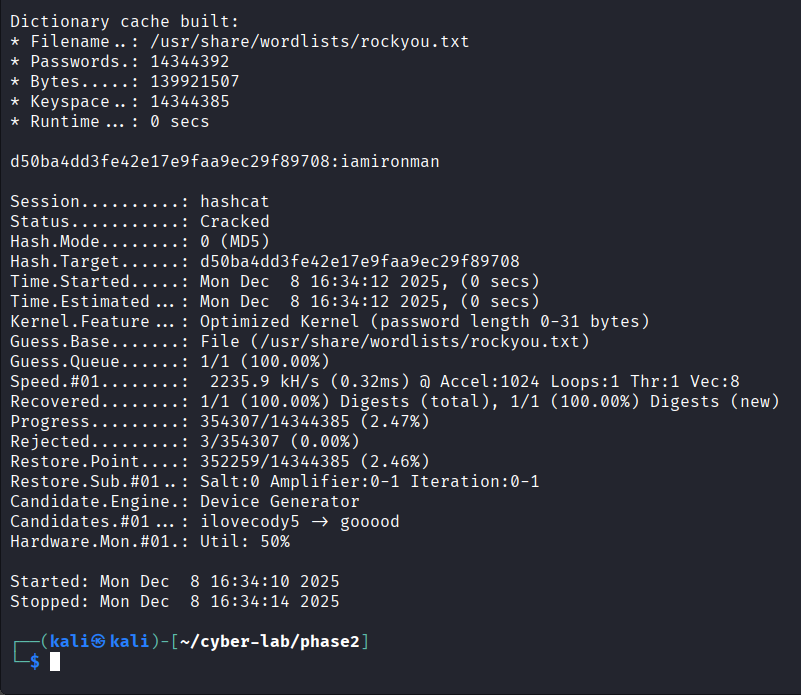
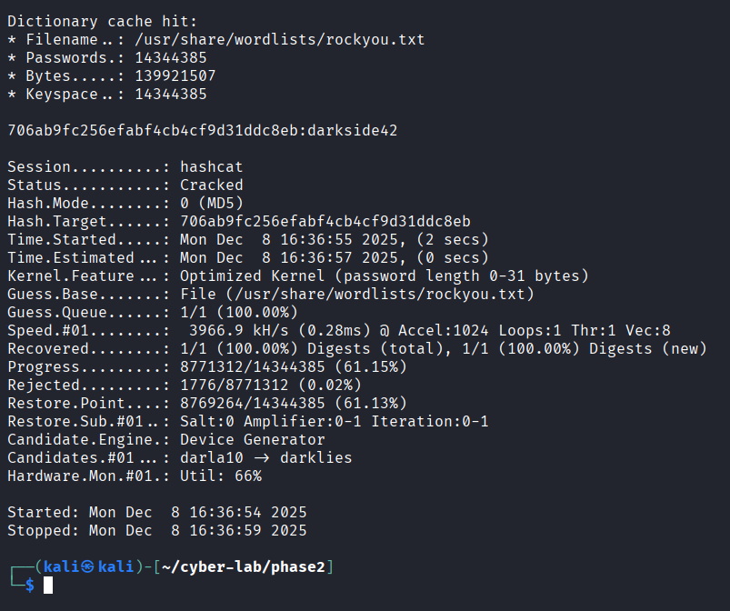
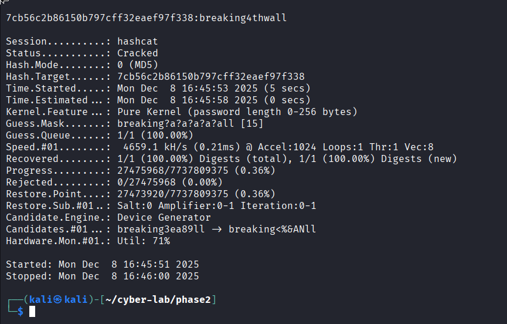
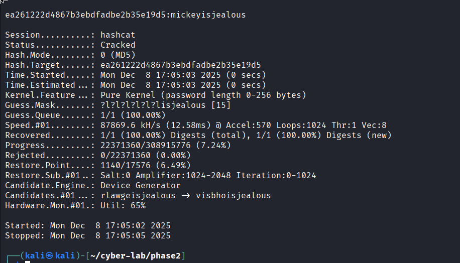

# Cracking task report

## 1. genius@starkindustries.com

* Known: Found via dictionary attack
* Method used: Hashcat dictionary attack with rockyou.txt wordlist
* hashcat command: `hashcat -O -m 0 -a 0 "d50ba4dd3fe42e17e9faa9ec29f89708" /usr/share/wordlists/rockyou.txt --force --potfile-disable`
* Found password: `iamironman`
* Screenshot: 

## 2. iamyourfather@deathstar.gov

* Known: Found via dictionary attack
* Method used: Hashcat dictionary attack with rockyou.txt wordlist
* hashcat command: `hashcat -O -m 0 -a 0 "706ab9fc256efabf4cb4cf9d31ddc8eb" /usr/share/wordlists/rockyou.txt --force --potfile-disable`
* Found password: `darkside42`
* Screenshot: 

## 3. chimichanga@fourthwall.com

* Known: 1 digit, 14 lowercase letters &rarr; first 8 are **breaking**, last 2 are **ll**
* Method used: Hashcat brute force attack
* hashcat command: `hashcat -m 0 -a 3 "7cb56c2b86150b797cff32eaef97f338" breaking?a?a?a?a?all`
* Found password: `breaking4thwall`
* Screenshot: 

## 4. ruhroh@mysterymachine.com

* Known: 1 digit, 12 lowercase letters &rarr; last 6 letters are **scooby**, the digit is the middle character 
* Method used: Hashcat brute force attack
* hashcat command: `hashcat -m 0 -a 3 "ad17fbd845000b11678ccbf94e135b56" ?l?l?l?l?l?l?dscooby`
* Found password: `snacks4scooby`
* Screenshot: 

## 5. quackattack@duckburg.org

* Known: 15 lowercase letters &rarr; last 9 letters are **isjealous** 
* Method used: Hashcat brute force attack
* hashcat command: `hashcat -m 0 -a 3 "ea261222d4867b3ebdfadbe2b35e19d5" ?l?l?l?l?l?lisjealous`
* Found password: `mickeyisjealous`
* Screenshot: 

## What is the main difference between Dictionary and Non-Dictionary attacks?

* Dictionary attacks use a list of known commonly used passwords. In the case of hashcat, it hashes these passwords one by one and compares these to the given hashes to find which password the hash corresponds to.
* Non-dictionary attacks (most commonly brute-force attacks) do not use a list of known passwords to compare against. Instead, every possible character combination is tried. The possible character combinations can be limited if some information about the password is known, e.g. if characters are lower- or uppercase letters or digits, or the length of the password.

## What advantage does and attacker gain by having access to the system's database that reveals the users and the password hashes? 
* Simply cracking a hash is much more time-efficient than trying to brute-force both username and password, especially if the password is hashed with a weak algorithm such as MD5.

## What concrete security benefits are achieved by using longer passwords instead of shorter ones? 

* Longer passwords are much more time-consuming to crack through brute force, as the possible character combinations to try increase exponentially with longer password length.
* Longer passwords are more resistant to dictionary attacks, as dictionaries usually contain commonly used passwords that are usually shorter.