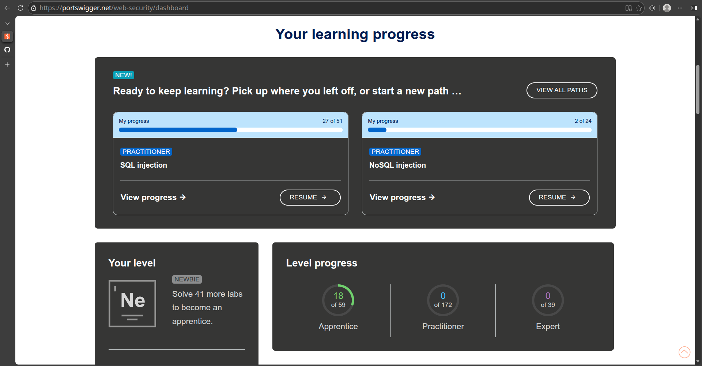

# Portswigger

## Dashboard screenshot

## Completed labs

* **SQL injection** &rarr; SQL injection vulnerability in WHERE clause allowing retrieval of hidden data
* **SQL injection** &rarr; SQL injection vulnerability allowing login bypass
* **Authentication** &rarr; Username enumeration via different responses
* **Authentication** &rarr; 2FA simple bypass
* **Authentication** &rarr; Password reset broken logic
* **Access control vulnerabilities** &rarr; Unprotected admin functionality
* **Access control vulnerabilities** &rarr; Unprotected admin functionality with unpredictable URL
* **Access control vulnerabilities** &rarr; User role controlled by request parameter
* **Access control vulnerabilities** &rarr; User role can be modified in user profile
* **Access control vulnerabilities** &rarr; User ID controlled by request parameter
* **Access control vulnerabilities** &rarr; User ID controlled by request parameter, with unpredictable user IDs
* **Access control vulnerabilities** &rarr; User ID controlled by request parameter with data leakage in redirect
* **Access control vulnerabilities** &rarr; User ID controlled by request parameter with password disclosure
* **Access control vulnerabilities** &rarr; Insecure direct object references
* **Cross-site scripting** &rarr; Reflected XSS into HTML context with nothing encoded
* **Cross-site scripting** &rarr; Stored XSS into HTML context with nothing encoded
* **Path traversal** &rarr; File path traversal, simple case
* **File upload vulnerabilities** &rarr; Remote code execution via web shell upload

Total 18 labs completed (2 SQL injection, 3 Authentication, 9 Access control, 2 Cross-site scripting, 1 Path traversal, 1 File upload vulnerabilities)
  

---
# The Booking system project

## Phase 1

The main challenge in this phase was learning how to use the relevant tools, especially ZAP. I started by exploring the booking system manually and finding vulnerabilities through the browser. My lacking knowledge of using ZAP lead to missing some critical vulnerabilities (path traversal, SQL injection) in ZAP at first, so I had to resubmit the ZAP report. The most severe  vulnerability I found in Part 1 of this phase was that the passwords were being sent to and stored in the database in plain text. Others were poor email and password verification functionality, GDPR issues (missing privacy policy) and lack of a CSP header detected by ZAP. 

The second part of this phase involved checking the previously detected vulnerabilities for whether they had been fixed. The most severe vulnerability had been fixed through implementing password hashing, the CSP header had been added and more robust email and password verification had been implemented. This part helped learn more about ways to fix vulnerabities, such as the above mentioned hashing of passwords. It was also a good refresher about topics such as HTTP requests and SQL syntax. 

Both the most time-consuming part and most important learning was becoming familiar with the testing tools such as ZAP. I found the course material to be a little light on practical information about these tools, so a lot of time was spent finding documentation for them online. 

## Phase 2

The main topic for this phase was authentication and password cracking, including both theory and practical examples in the form of cracking hashed passwords with different methods using hints given in the material. The tests from the previous phase were also re-run.

Overall I found this phase to be the easiest, as I had previously studied this topic in another cyber security course I took many years ago, but it was a good opportunity to refresh my memory and get updated information on the topic. 

To me the most important learning for this phase was the advantages and disadvantages of different authentication methods (passwords, tokens, biometrics, 2FA etc). The most time-consuming part was the password cracking exercise itself and once again understanding how to use the tools, but it was quite simple once I understood the syntax of the `hashcat` tool. 

## Phase 3

The topic of this phase was authorization, and involved testing what different user roles could and could not do. This was the most time-consuming phase as there were many things to test and the iterative approach meant multiple rounds of testing were needed.

It was quite hard to keep track of what had been tested as some tests required jumping between roles (e.g. creating resources and reservations to then try to modify or remove them using another).

I felt that the iterative approach used in this phase especially and in the Booking system project in general was an important thing to learn. Going from simple steps (exploring the system in a web browser) to more complicated ones (endpoint discovery) was important for building a good understanding of the system's functionality.

Iterating and using multiple tools were the most time-consuming parts of this phase, especially understanding the new tools introduced (`gobuster` and `wfuzz`). Making a short and concise report based on the complicated testing process was also quite challenging.

## Phase 4

This phase concentrated on GDPR compliance, and was thus quite different from the previous ones.

Understanding the specific requirements of GDPR and trying to apply them to assessing the booking system was quite difficult.

Diving into GDPR guides to find out if the site fulfilled the requirements was the most time-consuming part of this phase. 

Creating the privacy policy, terms of service and cookie policy for the system gave me an opportunity to pay attention to common things that appear in these documents, by comparing the documents I created with the help of AI with actual documents I have come across in previous development work (where the documents have been written by others but I have been responsible for including the content on the websites). I feel that this gave me a good practical understanding of what parts are required to be included in these documents.

## Reflection

Overall, this project gave a comprehensive understanding of the many aspects involved in the work of a penetration tester, in a way that covering different topics on their own would not have been able to. The iterative approach used also helped build an understanding step by step without the amount of information becoming too overwhelming. 

I learned to use many different tools (ZAP, hashcat, gobuster, wfuzz). I also learned how to perform testing iteratively, and about best practices regarding many topics (storing credentials, authentication, privacy etc.). Finally, I learned how to effectively and concisely report on findings from even quite complicated tests performed.
  

---
# Logbook

* Logbook: [logbook.md](logbook.md)

## Hours spent

* **Total hours spent: 83**
* Per topic:

| Topic | Hours |
| ----- | ----- |
| Lectures+workshops | 18 |
| Cisco Cybersecurity course | 7 |
| Portswigger | 11 |
| Booking system | 42 |
| Final assignment | 5 |
| **TOTAL** | **83** |

  

---
# Feedback

Overall, I found the course to be a good overview of a wide range of different cybersecurity-related topics. The course was generally quite well laid out, and I appreciated that most of the course material was on Github instead of Itslearning, since I find Itslearning to be a very complicated and unintuitive platform to use. 

The layout of the material could have been a little more consistent. For example, for some phases of the project, the task was given on Itslearning and in others on Github. It would have been most clear if the task was in the README.md file on Github for each project phase. Now it was sometimes on Itslearning and sometimes in a separate Learning_task.md file on Github. The learning material could also have included a bit more practical information about how to use the tools, especially ZAP.

I understand that the course only being 3 credits limited the scope of topics that could be covered in the course. I appreciate that we were introduced to platforms that give easy access to continued learning (especially Portswigger), as cybersecurity is a topic I find very interesting and want to learn more about.